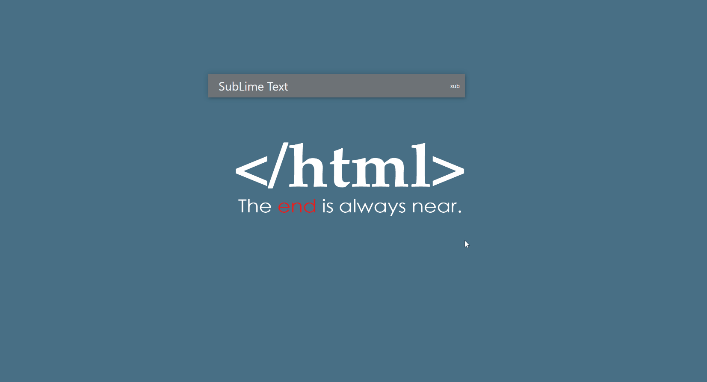

## quickly
一款跨平台的快速启动工具，类似于`mac`上的`LaunchBar`。

### 演示


### 功能
- [x] 基础功能
- [x] 自定义配置
- [x] 显示多条结果
- [ ] 自定义快捷键及其他设置
- [ ] 皮肤更换
- [ ] 导入导出配置
- [ ] 读取快捷方式列表(windows)

### 开发
下载
```
git clone https://github.com/AlanLang/quickly.git
```

开发
```
yarn start
```

打包
```
yarn package
```
唤醒快捷键: `Ctrl + space`